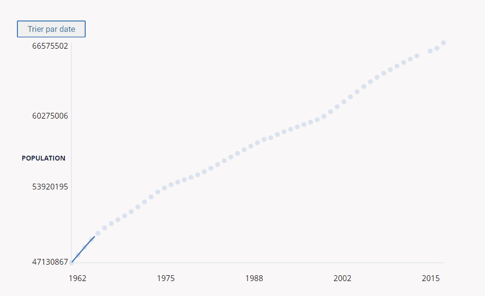

# GraphJS

*******************

GraphJS affiche des données JSON dans un graphique SVG avec des animations et un design époustouflant.
Dynamique, vous pouvez facilement changer le ficher de source JSON.
Il propose un filtre par date.
Supporte tous les navigateurs, il n'utilise aucune bibliothèque externe.

*******************

Ci-dessous un exemple de GraphJS.

